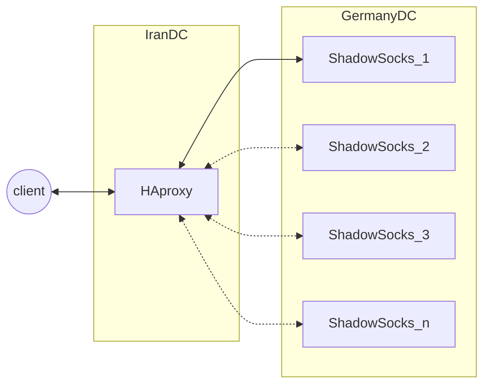

# پیاده سازی ShadowSocks و V2ray-plugin به وسیله Ansible

توسط این playهای Ansible می‌توانید، به سادگی به هنگام قطعی اینترنت در زمانی که دولت‌ها یا ISPها شما را قطع می‌کنند یا میخواهید ارتباطی امن با اینترنت جهانی داشته باشید بهتر است از ShadowSocks یا V2ray که هنوز دولت چین هم نتوانسته آن را ببندد استفاده کنید.

## رویکرد کلی

باید دوتا سرور حداقل داشته باشیم، یکی در داخل و بسته به لود چند تا در خارج.
_HAproxy_ در داخل وظیفه تونل زدن و بالانس کردن لود را فراهم می‌کند.



## راه‌اندازی سریع

به `/vars/main.yml` مراجعه کنید و با توجه به نیاز خودتان مقادیر `ss_password` و `external_node_domain` را تغییر دهید. بقیه موارد توصیه نمی‌شود.

سپس فایل `hosts.ini` را باتوجه به سرورهایتان تغییر دهید.
* `external`: در واقع سرور خارجی (بیرون ایران) می‌باشد.
* `internal` سرور داخل یکی از دیتاسنترهای ایران می‌باشد.
* دقت کنید که حتما `ansible_user` و مقدار `ansible_ssh_private_key_file` را باتوجه به مشخصات سرور خودتان تغییر دهید.

حال زمان اجرا دیپلوی رسیده کامند زیر را وارد کنید:

```
ansible-playbook -i hosts.ini v2ray.yml
```

برای دسترسی به سرور اطلاعات زیر را در برنامه اندرویدی ShadowSocks یا ویندوزی آن وارد کنید (اگر تغییر خاصی ندادید)

```
server: internal_server_ip
port:443
password: fuckthisshit
encrypt_method: aes-256-gcm
plugin: v2ray-plugin
```

### تشکر

با تشکر از ارسلان سالاری و توییترش که یادم انداخت با haproxy تونل کنم.

## منبع

https://medium.com/@ars.salari/%D9%86%D8%AD%D9%88%D9%87-%D8%B3%D8%A7%D8%AE%D8%AA-%D9%88%DB%8C-%D9%BE%DB%8C-%D8%A7%D9%86-%D8%B4%D8%AF%D9%88%D8%B3%D8%A7%DA%A9%D8%B3-v2ray-a261686dd8d2

